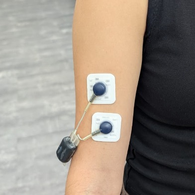
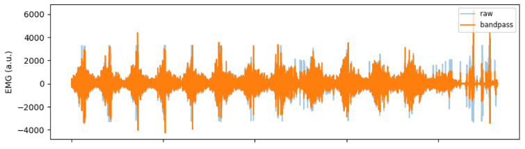
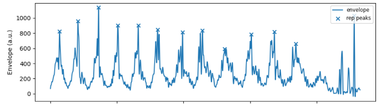

# Estimating Optimal Training Repetitions Using EMG-Based Muscle Fatigue Detection

## Team: BioTeam7
**Course:** Biomedical Signal Processing — 2025/26/1  
**Team Members:** Dario Ranieri, Islam Muhammad Muqsit, Zsuzsanna Rohán

---

## Abstract
This project focuses on the independent measurement and analysis of surface electromyography (EMG) signals to detect muscle fatigue in human arms during resistance training. By analyzing EMG signal characteristics, we aim to estimate the optimal number of repetitions per set for each individual, providing a personalized approach to training and rehabilitation.

---

## Research Objectives
* **Data Collection:** Conduct self-collected biomedical signal measurements using surface EMG on the Biceps Brachii during resistance training until task failure.
* **Pipeline Development:** Design and document a complete, reproducible data processing workflow in Python.
* **Feature Analysis:** Perform statistical and mathematical analysis on extracted features like Root Mean Square (RMS) and Median Frequency (MDF) to identify fatigue thresholds.
* **Optimization:** Estimate the optimal number of repetitions based on fatigue detection and validate these estimates against subjective feedback.

---

##  Hypothesis
* **Null Hypothesis ($H_0$):** There is no significant change in the Median Frequency (MDF) or Root Mean Square (RMS) of the EMG signal as contraction time increases during a set of repetitions.
* **Alternative Hypothesis ($H_1$):** As muscle fatigue progresses, the Median Frequency (MDF) will significantly decrease due to slowing muscle fiber conduction velocity, while the RMS amplitude will increase due to motor unit recruitment to maintain force.

---

## Methodology

### 1. Experimental Setup
* **Equipment:** Cometa MiniWave wireless EMG device with 3M Red Dot ECG surface electrodes.
* **Sampling Rate:** 2000 Hz.
* **Electrode Placement:** Biceps Brachii (2-3 cm inter-electrode distance).
* **Protocol:**
    * **Participants:** 12 healthy university students (aged 22-24) with varying fitness levels.
    * **Calibration:** Determined 1-Repetition Maximum (1RM) or suitable load (4x8 capability) for each subject.
    * **Exercise:** Bicep curls using a load of 60-70% 1RM performed until task failure.
    * **Rest:** 90-second rest periods between sets (3-5 sets total).
    * **Ground Truth:** Subjective feedback on perceived soreness/fatigue recorded after each set.

<p align="center">
 

</p>

### 2. Data Processing Pipeline
All processing steps are implemented in Python within this repository.

1.  **Preprocessing & Filtering:**
    * **Bandpass Filter:** 20–450 Hz to remove motion artifacts and high-frequency noise.
    * **Notch Filter:** 50 Hz to eliminate power line interference.
    * **Envelope Extraction:** Signal rectification followed by a Low-pass Envelope for smoothing.

2.  **Segmentation:**
    * Isolation of individual repetitions (approx. 2-second windows) based on signal envelopes.

3.  **Feature Extraction:**
    * **RMS (Root Mean Square):** Represents signal amplitude and muscle force. Increases with fatigue.
        $$RMS = \sqrt{\frac{1}{n} \sum_{i=1}^{n} x_i^2}$$
    * **MDF (Median Frequency):** The frequency dividing the power spectrum into two equal parts. Decreases with fatigue due to metabolic changes.

4.  **Analysis:**
    * **Trend Analysis:** Monitoring the increase in RMS and decrease in MDF across repetitions.
    * **Fatigue Threshold:** Identifying the crossover or significant deviation points in feature trends.
    * **Optimal Rep Estimation:** Correlating the identified fatigue point with the "optimal" repetition count.

---

## Results & Validation

The project successfully identifies trends where RMS increases and MDF decreases as the set progresses toward failure. The algorithm's estimated "optimal repetition" is compared against the user's recorded subjective soreness point (Ground Truth) to validate accuracy.

### Visualizations

**Figure 1: Raw vs. Filtered EMG Signal**
> 
> *Comparison of raw EMG signal and the signal after Bandpass and Notch filtering.*

**Figure 2: Optimal Repetition Estimation**
> 
> *Peak detection on a 2-second interval.*

---

## Installation & Usage

**Prerequisites:** Ensure you have **Python 3.10** installed.


1. **Clone the repository:**
   ```bash
   git clone https://github.com/muqsitamir/EMG_fatigue_detection.git
   cd EMG_fatigue_detection
   pip install -r requirements.txt
   python main.py
   
